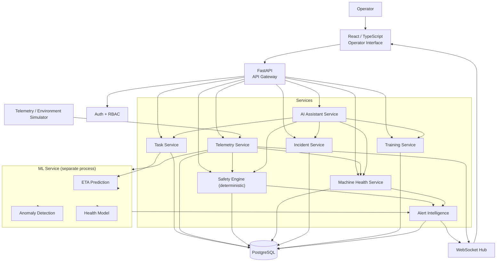
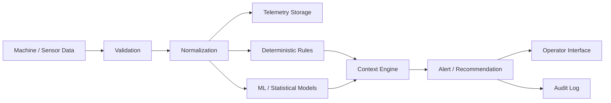
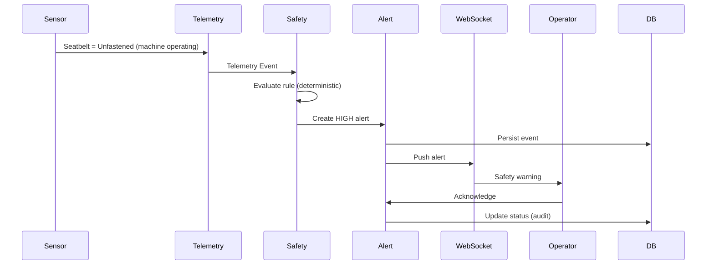
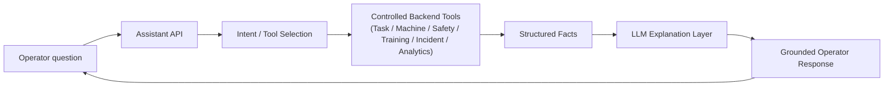
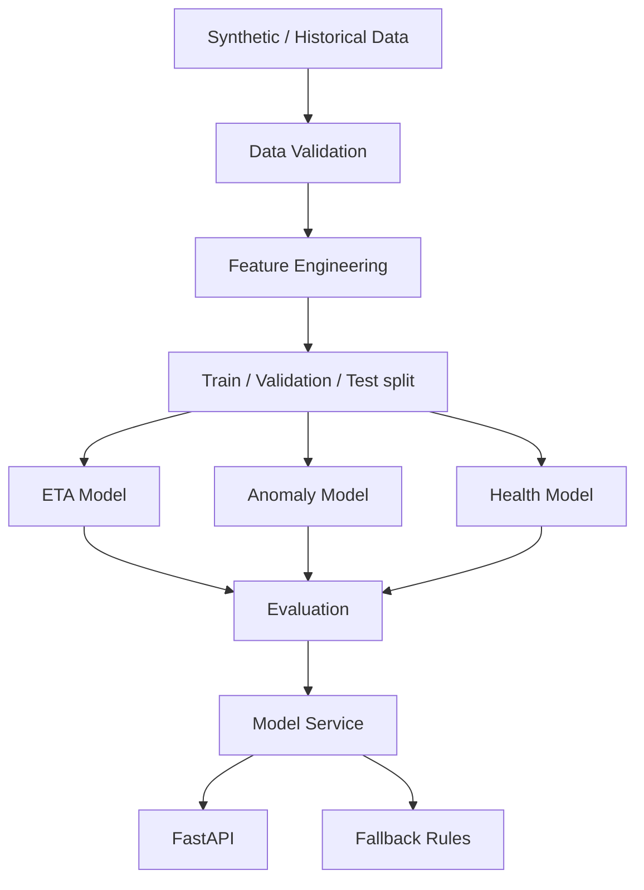
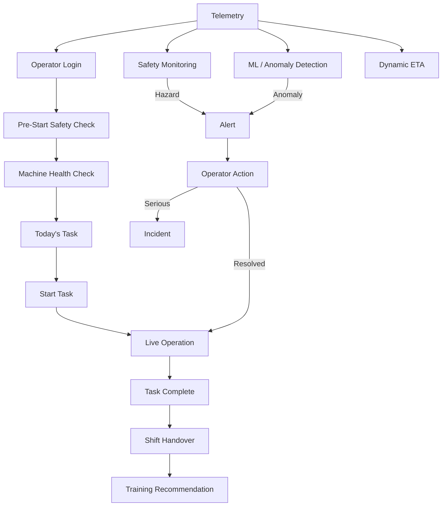

# Architecture

Owner: Claude 4 (Architecture / Integration / QA). Keep this in sync with
`API_CONTRACT.md` and `DATA_MODEL.md`.

## 1. System overview



**Key boundary:** the ML models run as a **separate service** behind an HTTP
interface (`ML_SERVICE_URL`). The backend calls it and applies a deterministic
fallback on any failure or timeout. This keeps the safety-critical backend
independent of ML availability.

## 2. Telemetry / intelligence pipeline



Validation and normalization run **before** anything is stored or evaluated.
Malformed or impossible readings are quarantined, not evaluated as safety events.

## 3. Safety event flow (deterministic)



The **Safety Engine never calls the LLM**. The AI Assistant may later *explain*
an event that the rules already created.

## 4. AI assistant architecture (grounded)



Rules: the LLM never queries the DB, never invents telemetry, never makes
safety decisions. If a tool returns "no data", the answer says the data is
unavailable. A deterministic template explainer is used when no LLM is
configured (`LLM_PROVIDER` empty).

## 5. ML pipeline



Details, features, metrics, and fallbacks: `ML.md`.

## 6. Full operator workflow (the product story)



This is the single continuous story the demo follows (`DEMO.md`).

## 7. Backend layering

```
API layer (routers)      -> request/response only, no business logic
  Service layer          -> business logic, orchestration
    Repository layer     -> DB access (SQLAlchemy)
    Safety engine        -> deterministic rules
    ML client            -> HTTP to ML service + fallback
Database (PostgreSQL)
```

No business logic in route handlers. No SQL in services (goes through repos).

## 8. Real-time architecture

Telemetry ingest → telemetry service → rules + ML → alert service → WebSocket hub
→ frontend. Reconnect with backoff on the client; the hub replays the current
active-alert snapshot on (re)connect so a reconnecting client is never blind.

## 9. Reliability / failure handling

| Failure | Behavior |
|---------|----------|
| Missing/stale telemetry | UI shows "Telemetry unavailable — last update Xs ago"; no fake values |
| Malformed reading | Quarantined at validation; logged; not evaluated |
| Duplicate event | Idempotency key on ingest; deduplicated |
| ML service down/slow | Backend uses rule-based fallback (historical average / thresholds) |
| DB unavailable | 503 with clear error; safety cache serves last-known critical state |
| WebSocket disconnect | Client backoff reconnect; snapshot replay on reconnect |

## 10. Deployment

Docker Compose for the demo (db + backend + ml + frontend). CI in
`.github/workflows/ci.yml` runs lint + unit + integration on push.
