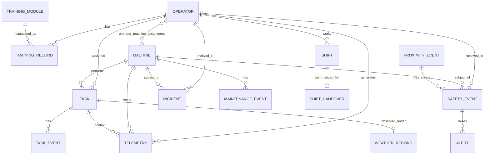

# Data Model

Owner: Claude 1 (schema implementation) + Claude 4 (contract). Keep aligned with
`API_CONTRACT.md`.

## ER diagram

## Tables

### operator
`id (PK)`, `name`, `role`, `password_hash`, `created_at`.

### machine
`id (PK)`, `type`, `model`, `site_id`, `status`, `engine_hours`.

### operator_machine_assignment
`id (PK)`, `operator_id (FK)`, `machine_id (FK)`, `shift_id (FK)`, `active`.

### task
`id (PK)`, `title`, `type`, `priority`, `site_id`, `machine_id (FK)`,
`operator_id (FK)`, `state`, `progress`, `scheduled_start`, `original_eta`,
`predicted_eta`, `delay_reason`, `created_at`.

### task_event
`id (PK)`, `task_id (FK)`, `event_type`, `timestamp`, `payload (jsonb)`.

### telemetry
`id (PK)`, `idempotency_key (unique)`, `timestamp`, `machine_id (FK)`,
`operator_id (FK)`, `engine_hours`, `fuel_used`, `fuel_rate`, `load_cycles`,
`idle_time`, `cycle_time`, `engine_temperature`, `hydraulic_pressure`,
`engine_load`, `speed`, `latitude`, `longitude`, `seatbelt_status`,
`warning_code`, `machine_state`, `quarantined (bool)`, `provenance`.
Indexes: `(machine_id, timestamp)`, `(operator_id, timestamp)`.

### safety_event
`id (PK)`, `timestamp`, `type`, `severity`, `machine_id (FK)`,
`operator_id (FK)`, `latitude`, `longitude`, `telemetry_context (jsonb)`,
`recommended_action`, `acknowledged`, `provenance`.

### alert
`id (PK)`, `severity`, `status`, `count`, `grouped_event_ids (jsonb)`,
`summary`, `created_at`, `acknowledged_at`, `acknowledged_by`, `escalated_to`.

### proximity_event
`id (PK)`, `timestamp`, `machine_id (FK)`, `entity_type`, `entity_id`,
`distance_m`, `threshold_m`, `provenance` (SIMULATED).

### incident
`id (PK)`, `machine_id (FK)`, `operator_id (FK)`, `type`, `description`,
`occurred_at`, `timeline (jsonb)`, `notes`, `review_status`, `created_at`.

### training_module
`id (PK)`, `title`, `description`, `machine_type`, `video_url`.

### training_record
`id (PK)`, `operator_id (FK)`, `module_id (FK)`, `status`, `completion`,
`reason`, `provenance`, `updated_at`.

### maintenance_event
`id (PK)`, `machine_id (FK)`, `type`, `scheduled_completion`, `status`, `notes`.

### weather_record
`id (PK)`, `site_id`, `timestamp`, `temperature`, `rainfall`, `wind`,
`visibility`, `humidity`, `provenance` (SIMULATED).

### shift
`id (PK)`, `operator_id (FK)`, `machine_id (FK)`, `start`, `end`.

### shift_handover
`id (PK)`, `shift_id (FK)`, `summary (jsonb)`, `generated_at`.

## Provenance column

Every table that can hold non-real data carries a `provenance` column
(`REAL | SIMULATED | ASSUMED | PREDICTED | OBSERVED`). For this prototype almost
all rows are `SIMULATED`; derived analytics are `OBSERVED`; model outputs are
`PREDICTED`. See `ASSUMPTIONS.md`.
